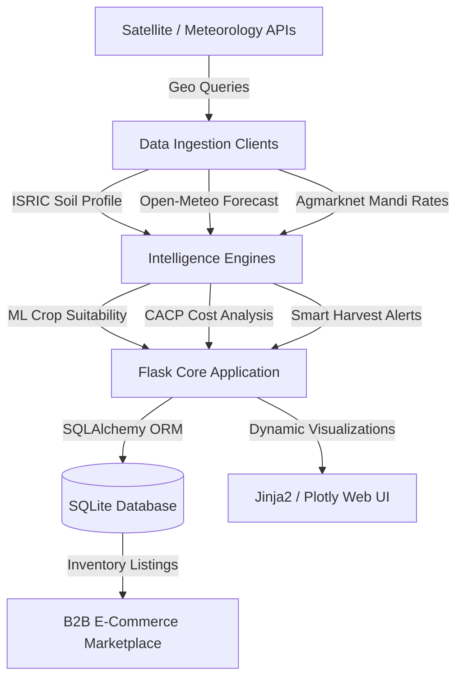

Grow Fasal: Quantitative Agricultural Advisory & High-Trust B2B Marketplace

Grow Fasal is a logic-dense, data-centric Flask platform designed to optimize agricultural operations, regional economic planning, and supply chain logistics for farmers and wholesale buyers. 

The system leverages a multi-algorithm machine learning suite, real-time government API feeds, state-specific economic benchmarks, and geospatial geocoding algorithms to transform raw soil and climatic features into clear agronomic recommendations and high-precision financial projections.

---

 🏗️ System Architecture & Data Flow

The platform is designed around a clean separation of concerns, separating data ingestion, intelligence models, database persistence, and user interfaces:




 Quantitative Machine Learning Suite

The intelligence core (`engine/ml_suite.py`) operates on a five-model suite designed to handle recommendation, time-series forecasting, and probabilistic risk modeling.

### 1. Ensemble Crop Suitability Classifier
The system recommends optimal crops by pooling class probabilities from a Random Forest ($RF$) classifier and an eXtreme Gradient Boosting ($XGB$) classifier. Given input vector $\mathbf{x} = [N, P, K, T, H, \text{pH}, R]$ (soil nutrients, temperature, humidity, pH, and seasonal rainfall):

$$P(\text{Crop}_c \mid \mathbf{x}) = \frac{P_{RF}(\text{Crop}_c \mid \mathbf{x}) + P_{XGB}(\text{Crop}_c \mid \mathbf{x})}{2}$$

The top 3 crops with the highest ensemble probability are returned.

 2. Bayesian Pest Risk Outbreak Probability
Pest risk levels are determined using a Gaussian Naive Bayes model. It uses seasonal temperature $T$ and humidity $H$ variables to classify the probability of an outbreak ($R \in \{0, 1\}$):

$$P(R = 1 \mid T, H) = \frac{P(T, H \mid R = 1) \cdot P(R = 1)}{P(T, H)}$$

Where $P(T, H \mid R = 1)$ is modeled under joint normal distributions assuming feature independence:

$$P(T, H \mid R=1) = \frac{1}{\sqrt{2\pi\sigma_T^2}} e^{-\frac{(T-\mu_T)^2}{2\sigma_T^2}} \times \frac{1}{\sqrt{2\pi\sigma_H^2}} e^{-\frac{(H-\mu_H)^2}{2\sigma_H^2}}$$

### 3. Recurrent Weather Anomaly & Hazard Detector
For weather hazard detection, the system feeds a historical sequence of weather metrics $\mathbf{S} = [s_1, s_2, \dots, s_{10}]$ (representing 10-day rainfall trend) into a Long Short-Term Memory (LSTM) network. The LSTM cell uses gate structures to track state vectors:

$$\begin{aligned}
f_t &= \sigma(W_f \cdot [h_{t-1}, s_t] + b_f) && \text{(Forget Gate)} \\
i_t &= \sigma(W_i \cdot [h_{t-1}, s_t] + b_i) && \text{(Input Gate)} \\
\tilde{C}_t &= \tanh(W_c \cdot [h_{t-1}, s_t] + b_c) && \text{(Candidate Cell State)} \\
C_t &= f_t * C_{t-1} + i_t * \tilde{C}_t && \text{(Updated Cell State)} \\
o_t &= \sigma(W_o \cdot [h_{t-1}, s_t] + b_o) && \text{(Output Gate)} \\
h_t &= o_t * \tanh(C_t) && \text{(Hidden Output)}
\end{aligned}$$

The final layer uses a sigmoid activation to output hazard risk percentage.

4. Time-Series Price Trend Forecasting
Market commodity price trends are simulated using Facebook's Prophet framework, modeled as an additive regression:

$$y(t) = g(t) + s(t) + h(t) + \epsilon_t$$

*   $g(t)$: Piecewise linear or logistic growth curve trend.
*   $s(t)$: Periodic seasonal changes (e.g., weekly, yearly).
*   $h(t)$: Holiday effects representing temporary market closures.
*   $\epsilon_t$: Error term representing anomalous variance.


📈 Economic Profitability Engine

The profitability engine (`engine/economics.py`) models agricultural inputs and revenues using state-specific cost variables defined by the **Commission for Agricultural Costs and Prices (CACP)**. 

Production cost formulas reflect both crop multipliers ($\gamma_{crop}$) and regional factor multipliers representing mechanization ($M_{state}$), irrigation ($I_{state}$), and labor ($L_{state}$):

$$\text{Production Cost} = \text{Base Cost}_{state} \times \gamma_{crop} \times \left(\frac{M_{state} + I_{state} + L_{state}}{3}\right) \times \text{Acreage}$$

Using the calculated production cost ($C_{prod}$) and revenue ($R = P_{market} \times Y_{yield} \times \text{Acreage}$), the engine computes:

*   **Net Profit**: $\Pi = R - C_{prod}$
*   **Profit Margin**: $\text{Margin (\%)} = \frac{\Pi}{R} \times 100$
*   **Return on Investment (ROI)**: $\text{ROI (\%)} = \frac{\Pi}{C_{prod}} \times 100$

---

 Geospatial Geocoding & Data Clients

 1. Mandi Proximity Geocoding
To find the closest wholesale market (Mandi) to a farmer's coordinate point $(\phi_1, \lambda_1)$, the system applies the **Haversine formula** across a pre-calculated index of geocoded major Indian wholesale markets $(\phi_2, \lambda_2)$:

$$\begin{aligned}
a &= \sin^2\left(\frac{\phi_2 - \phi_1}{2}\right) + \cos(\phi_1)\cos(\phi_2)\sin^2\left(\frac{\lambda_2 - \lambda_1}{2}\right) \\
c &= 2 \cdot \operatorname{atan2}\left(\sqrt{a}, \sqrt{1-a}\right) \\
d &= R_{earth} \cdot c
\end{aligned}$$

Where $R_{earth} \approx 6371\text{ km}$. The nearest functional Mandis are returned, sorted by ascending distance ($d$).

 2. Caching Strategy (Agmarknet Live API)
To prevent network bottlenecks and handle API rate limits, `engine/mandi_api.py` implements an active caching mechanism:
*   Fetches the data.gov.in Agmarknet feed and writes JSON payloads locally.
*   Verifies a timestamp file. Cache hit occurs if local log is `< 86,400 seconds` (24 hours) old.
*   Falls back gracefully to stale cache logs or geographic mock averages if the government API endpoints are offline.

---

Testing Suite & Verification

The project includes an automated test framework containing 13 distinct verification cases to check regression, bounds limits, and parser integrity.

 Run Tests Locally
You can run the full test suite locally by running:

```bash
python tests/test_suite.py
```

 CI/CD Pipeline
A GitHub Actions workflow is active at `.github/workflows/python-tests.yml`. On every push to the `main` branch, the pipeline:
1. Initializes a virtual environment on Ubuntu-Latest running Python 3.10.
2. Installs requirements from `requirements.txt`.
3. Runs the test suite to guarantee code stability.

---

 Quick Start

1. Installation
Clone the repository and install the dependencies:

```bash
pip install -r requirements.txt
```

 2. Configuration
Create a `.env` file in the root directory and add your Agmarknet credentials:

```env
SECRET_KEY=your-secret-key-123
DATA_GOV_API_KEY=your-data-gov-api-key
```

 3. Execution
Launch the local web server:

```bash
python app.py
```

Navigate to `http://localhost:5000` to interact with the platform.
